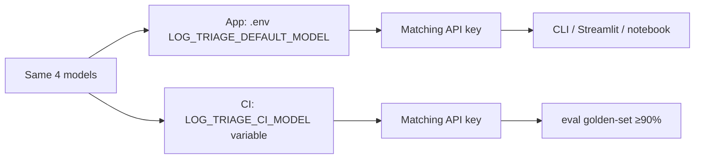

# LLM Log Triage

**Open source (MIT).** Clone, add your own LLM API keys, and run — no license fee, no vendor lock-in. You pay only your provider (OpenAI, Anthropic, etc.) for inference.

**LangChain LCEL app:** raw log text in → structured JSON out (severity, category, cause, action).

Golden-set evals, pytest CI gate, optional LangSmith tracing/experiments, and three interfaces (CLI, Streamlit, notebook).

**Architecture & diagrams:** system design, module map, and Mermaid flowcharts — see [docs/architecture.md](docs/architecture.md).

## Evaluation-Driven Development (EDD)

**What it is:** Evaluation-Driven Development means you **define how success looks before you ship changes** — fixed test cases (a golden set), automated scoring, and CI gates — instead of relying on manual “try a prompt and eyeball it.”

**Purpose:** Give LLM apps the same discipline as traditional software: measurable quality, regression detection when prompts or models change, and confidence that a green build means something real.

**Why we need it:** LLM output is non-deterministic and easy to break silently. A small prompt tweak can pass one demo log and fail twenty others. EDD catches that **before merge**, not in production.

**Benefits:**

- **Repeatable quality bar** — same golden set, same scorer, every run
- **Faster iteration** — change prompt/model, run evals, see pass rate immediately
- **Teachable OSS pattern** — others can clone, run tests, and trust the gate
- **Observability-friendly** — traces and offline experiments plug into the same eval harness

**App first, then EDD.** You cannot meaningfully practice EDD in the abstract — you need a **concrete app** to evaluate. This repo’s **LLM Log Triage** app is that vehicle: a small, frozen LangChain pipeline with labeled logs and structured JSON output. We apply EDD **to this app** (golden set, code reviewer, optional LLM judge, CI). Running the app helps you **see** what each eval layer is checking; the eval layers help you **trust** the app as you change it.

| Layer | Reviewer | What it checks | Merge gate? |
| ----- | -------- | -------------- | ----------- |
| **L0** | Pydantic schema | Valid JSON shape | Yes (`test (free)` CI) |
| **L1** | **Code reviewer** (`eval_checks.py`) | Severity, category, keywords vs `data/golden_set.json` | Yes (`eval (golden-set)` CI) |
| **L2** | **LLM judge** (`judge.py`) | Coherence + actionability ≥ 4/5 | Manual / notebook only |

The same L1 scorer (`eval_checks.score_case`) runs in pytest, the notebook, and LangSmith experiments — **offline parity**. Details and flowcharts: [docs/architecture.md](docs/architecture.md#4-eval-architecture-three-levels).

## Quick start

```bash
git clone https://github.com/KhwajaMKhan/llm-log-triage.git
cd llm-log-triage
python -m venv .venv && source .venv/bin/activate
pip install -e ".[dev,obs]"
cp .env.example .env   # add API key(s) for your chosen model — see below
```

## Pick a model (4 supported)

Choose one model. Set the **matching API key** in `.env`. Streamlit has the same dropdown.

| Model | Provider | API key in `.env` |
| ----- | -------- | ----------------- |
| `gpt-4o-mini` **(default)** | OpenAI | `OPENAI_API_KEY` |
| `gpt-4o` | OpenAI | `OPENAI_API_KEY` |
| `claude-sonnet-4-6` | Anthropic | `ANTHROPIC_API_KEY` |
| `claude-opus-4-7` | Anthropic | `ANTHROPIC_API_KEY` |

```bash
# Example: OpenAI (default)
LOG_TRIAGE_DEFAULT_MODEL=gpt-4o-mini
OPENAI_API_KEY=sk-...

# Example: Anthropic
LOG_TRIAGE_DEFAULT_MODEL=claude-sonnet-4-6
ANTHROPIC_API_KEY=sk-ant-...
```

**CI (merge gate):** pick the **same model** via repo variable `LOG_TRIAGE_CI_MODEL` (default `gpt-4o-mini`) + matching secret. Same 4 choices as the app — no separate CI model list.

| Where | Setting |
| ----- | ------- |
| **Local app** | `LOG_TRIAGE_DEFAULT_MODEL` in `.env` |
| **GitHub CI** | `LOG_TRIAGE_CI_MODEL` in Settings → Variables |
| **Secrets** | `OPENAI_API_KEY` and/or `ANTHROPIC_API_KEY` (whichever models you use) |



### Run

```bash
# CLI
python -m llm_log_triage.cli --log-file data/sample.log
echo "ERROR payments-db connection refused" | python -m llm_log_triage.cli

# Streamlit (use project venv — conda/base `streamlit` won't see llm_log_triage)
source .venv/bin/activate
streamlit run ui/streamlit_app.py
# or: ./scripts/run_streamlit.sh

# Notebook (run from repo root or notebooks/)
jupyter notebook notebooks/explore.ipynb
```

**Streamlit — try these logs** (paste into **Paste log text**, click **Triage**):

| Example | Log line |
| ------- | -------- |
| DB down (SEV2) | `2026-05-28T14:02:11Z ERROR payments-api Failed to connect to postgres://payments-db:5432 - connection refused` |
| OOM kill (SEV1) | `2026-05-28T14:05:33Z FATAL auth-service OOMKilled container exceeded memory limit 512Mi` |
| Slow upstream (SEV3) | `2026-05-28T14:08:02Z WARN api-gateway upstream latency p99=3200ms target=500ms service=inventory-svc` |
| Expired JWT (SEV3) | `2026-05-28T14:10:44Z ERROR checkout-web JWT validation failed: token expired for user_id=8821` |

### Example JSON responses

**Triage output** (what `chain.invoke()` returns — one live example for the DB-down log):

```json
{
  "severity": "SEV2",
  "category": "connectivity",
  "likely_cause": "Database is unreachable due to connection refusal.",
  "suggested_action": "Check if the database service is running and accessible from the payments-api.",
  "confidence": 0.9,
  "evidence_lines": [
    "Failed to connect to postgres://payments-db:5432 - connection refused"
  ]
}
```

**LLM judge output** (optional second pass — scores triage quality; sample from `docs/eval-runs/judge-fail-smoke-latest.json` when triage contradicts the log):

```json
{
  "case_id": "judge-fail-smoke",
  "passed": false,
  "triage": {
    "severity": "SEV4",
    "category": "unknown",
    "likely_cause": "No issue detected; log looks healthy.",
    "suggested_action": "No action required.",
    "confidence": 0.1
  },
  "judge": {
    "coherence": 1,
    "actionability": 1,
    "rationale": "The assessment contradicts the log evidence, which clearly indicates a connection failure to the database."
  }
}
```

### Test

```bash
pytest tests/ -m "not llm" -v    # no API keys — start here
pytest tests/ -m llm -v          # golden set gate (prompt v3, ≥90%)
pytest tests/ -m smoke -v        # one live call
```

More detail: [`docs/architecture.md`](docs/architecture.md) · [`docs/ROADMAP.md`](docs/ROADMAP.md) · [`data/golden_set.README.md`](data/golden_set.README.md)

## What's in the box


| Piece                                  | Role                                       |
| -------------------------------------- | ------------------------------------------ |
| `src/llm_log_triage/chain.py`          | LCEL triage pipeline (`invoke`)            |
| `src/llm_log_triage/providers.py`      | 4 supported models → OpenAI or Anthropic   |
| `data/golden_set.json`                 | 26 labeled eval cases                      |
| `src/llm_log_triage/eval_checks.py`    | Deterministic scorer (pytest + LangSmith)  |
| `src/llm_log_triage/langsmith_eval.py` | Dataset sync + offline experiments         |
| `src/llm_log_triage/instrumentation/`  | Swap observability backend (`OBS_BACKEND`) |
| `ui/streamlit_app.py`                  | Streamlit demo UI                          |


## Observability (LangSmith)

Default `.env.example` uses `OBS_BACKEND=langsmith`. Add `LANGCHAIN_API_KEY`, then:

```bash
./scripts/run_langsmith_eval_golden.sh
```

Traces go to LangSmith project `llm-log-triage`. Offline experiments use the same `eval_checks` scorer as pytest.

Optional helper: `./scripts/run_streamlit.sh` (same as `streamlit run ui/streamlit_app.py`).

## Interface tags (`interface=`)

Every triage call goes through `chain.invoke(..., interface=...)`. The value labels **where the call came from** — useful in LangSmith traces (`interface:cli`, etc.) and eval reports. There is no `github` interface; CI runs pytest directly.

| Entry point | `interface` value | Set in |
| ----------- | ----------------- | ------ |
| CLI | `cli` | `cli.py` |
| Streamlit | `streamlit` | `ui/streamlit_app.py` |
| Jupyter notebook | `notebook` | `notebook_runner.py` |
| **GitHub Actions CI** | **`pytest`** | `tests/test_golden_set.py`, `tests/test_judge.py` |
| Local pytest | `pytest` | same test files |
| LangSmith eval script | `langsmith_eval` | `langsmith_eval.py` |
| (default if omitted) | `unknown` | `chain.py` |

**CI workflows:** `ci.yml` runs `pytest -m "not llm"` (no live LLM, no interface tag). `eval-gate.yml` runs `pytest -m llm` with **`interface="pytest"`** on each golden-set case. CI sets `OBS_BACKEND=none`, so tags are not sent to LangSmith unless you change that.

## GitHub Actions workflows

Four workflows live under [`.github/workflows/`](.github/workflows/). See also [`.github/workflows/README.md`](.github/workflows/README.md).

### Automatic (every push & pull request to `main`)

| Workflow file | Job name | Trigger | API keys | What it does |
|---------------|----------|---------|----------|--------------|
| [`ci.yml`](.github/workflows/ci.yml) | `test (free)` | **Automatic** — `push` / `pull_request` → `main` | None | Deterministic tests only: `pytest -m "not llm"`. Schema, eval logic, instrumentation mocks — no live LLM calls. |
| [`eval-gate.yml`](.github/workflows/eval-gate.yml) | `eval (golden-set)` | **Automatic** — `push` / `pull_request` → `main` | Matching key for `LOG_TRIAGE_CI_MODEL` | Same 4 models as app (repo variable; default `gpt-4o-mini`). Golden-set ≥90%. |

### Manual only (`workflow_dispatch` — you click Run)

| Workflow file | Job name | Trigger | API keys | What it does |
|---------------|----------|---------|----------|--------------|
| [`manual-langsmith-eval.yml`](.github/workflows/manual-langsmith-eval.yml) | `manual langsmith eval` | **Manual** — model **dropdown** | Matching key + `LANGCHAIN_API_KEY` | LangSmith experiment (4 models). Not a PR gate. |
| [`manual-judge-eval.yml`](.github/workflows/manual-judge-eval.yml) | `manual judge eval` | **Manual** | Matching key for `LOG_TRIAGE_CI_MODEL` | L2 judge — same CI model variable. Not a PR gate. |

**One-time setup:** Settings → Secrets → add `OPENAI_API_KEY` and/or `ANTHROPIC_API_KEY`; Variables → `LOG_TRIAGE_CI_MODEL` (default `gpt-4o-mini`). See [Pick a model](#pick-a-model-4-supported) above.

### Run manual judge eval

**On GitHub (Actions):**

1. Open [github.com/KhwajaMKhan/llm-log-triage/actions](https://github.com/KhwajaMKhan/llm-log-triage/actions).
2. Select **Manual Judge Eval** in the left sidebar.
3. Click **Run workflow** (branch: `main`).
4. Choose **obs_backend**: `none` (default, no tracing) or `langsmith` (requires `LANGCHAIN_API_KEY` secret).
5. Click **Run workflow** again to start.
6. When finished, open the run → **Artifacts** → download `judge-eval-report` (`judge-latest.json` and timestamped copies).

**Locally (same tests, faster iteration):**

```bash
cd llm-log-triage
source .venv/bin/activate
./scripts/run_judge_eval.sh
```

Optional:

```bash
# Limit cases (default 5; use "all" for full golden set)
LOG_TRIAGE_JUDGE_MAX_CASES=3 ./scripts/run_judge_eval.sh

# Fail-smoke only (prove judge rejects bad triage)
pytest tests/test_judge.py::test_judge_rejects_deliberately_bad_triage -m judge -v -s

# With LangSmith tracing
OBS_BACKEND=langsmith ./scripts/run_judge_eval.sh
```

Report path: `docs/eval-runs/judge-latest.json`. Fail-smoke sample: `docs/eval-runs/judge-fail-smoke-latest.json`.

## License

Released under the **[MIT License](LICENSE)** — use freely in personal, educational, **commercial**, and **production** projects. Please **keep the copyright notice** in copies and derivatives so attribution stays visible.

**No warranty.** Triage output and eval scores may be wrong or incomplete. Read **[DISCLAIMER.md](DISCLAIMER.md)** before relying on this software for incident severity, on-call, or safety-critical decisions.