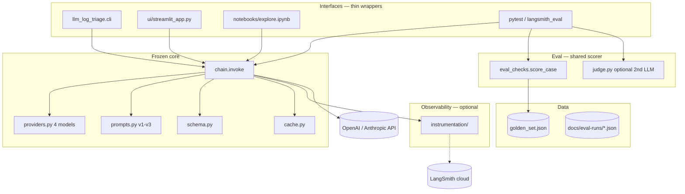
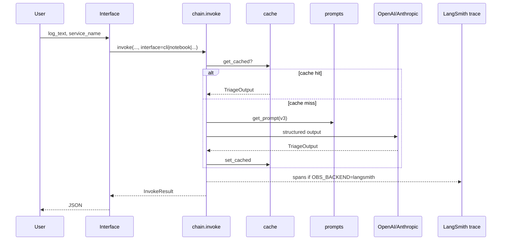
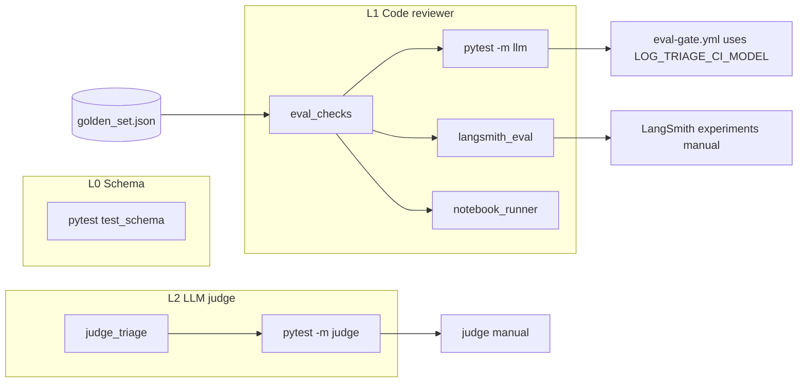
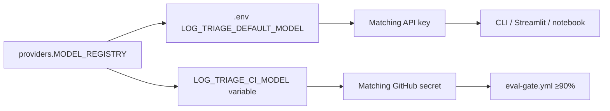

# Architecture

System design for **LLM Log Triage** (`src/llm_log_triage/`). Quick start: [README.md](../README.md).

---

## 1. Context (C4 — Level 1)

Helps on-call engineers turn raw log text into structured triage JSON (severity, category, cause, action).

**Users:** SRE / platform engineer via CLI, Streamlit, or Jupyter notebook.

**External systems:** OpenAI or Anthropic (inference), optional LangSmith / OpenTelemetry (observability only).

---

## 2. Containers (C4 — Level 2)



**Observability swap:** only `instrumentation/` + `OBS_BACKEND` change; chain, prompts, and golden set stay fixed.

---

## 3. Request flow (single triage call)



---

## 4. Eval architecture (three levels)



| Level | Reviewer | CI merge gate? | Manual scripts |
|-------|----------|----------------|----------------|
| L0 | Pydantic | `test (free)` | — |
| L1 | `eval_checks` | **`eval (golden-set)`** — model from `LOG_TRIAGE_CI_MODEL`, ≥90% | `scripts/run_langsmith_eval_golden.sh` |
| L2 | `judge.py` | No | `scripts/run_judge_eval.sh`, `manual-judge-eval.yml` |

---

## 5. Module map (`src/llm_log_triage/`)

| Module | Responsibility |
|--------|----------------|
| `chain.py` | **Single entry:** `invoke()` — LCEL prompt \| LLM → `TriageOutput` |
| `providers.py` | **Supported models only:** `MODEL_REGISTRY` (4 models → OpenAI or Anthropic) |
| `prompts.py` | Prompt templates v1→v3 (`get_prompt`) |
| `schema.py` | `TriageInput`, `TriageOutput`, enums |
| `eval_checks.py` | **Single scorer** for golden set (parity) |
| `judge.py` | Second LLM — coherence/actionability (charter #4) |
| `cache.py` | Disk cache keyed by log+model+prompt |
| `cli.py` | CLI wrapper |
| `notebook_runner.py` | Notebook live runs + report rows |
| `notebook_report.py` | JSON session reports → repo-root `docs/eval-runs/` |
| `notebook_setup.py` | `.env`, kernel check, `find_repo_root()` |
| `langsmith_eval.py` | Sync dataset + `langsmith.evaluate()` |
| `judge_report.py` | Judge JSON artifacts |
| `instrumentation/` | `OBS_BACKEND` switch (langsmith, otel, …) |

---

## 6. Model selection (app & CI)

One list of **four supported models** in `providers.py` (`MODEL_REGISTRY`). Streamlit, LangSmith manual workflow, and CI all use this same list.

| Model | Provider | API key |
|-------|----------|---------|
| `gpt-4o-mini` **(default)** | OpenAI | `OPENAI_API_KEY` |
| `gpt-4o` | OpenAI | `OPENAI_API_KEY` |
| `claude-sonnet-4-6` | Anthropic | `ANTHROPIC_API_KEY` |
| `claude-opus-4-7` | Anthropic | `ANTHROPIC_API_KEY` |

| Where | Setting |
|-------|---------|
| **Local app** | `LOG_TRIAGE_DEFAULT_MODEL` in `.env` (or Streamlit dropdown) |
| **GitHub CI** | `LOG_TRIAGE_CI_MODEL` repo variable (default `gpt-4o-mini`) |



CI workflows call `python -m llm_log_triage.providers --check-secrets` before live evals. Unknown model ids are rejected — add new models to `MODEL_REGISTRY` first.

**Interface tags:** CI pytest runs use `interface=pytest` (not `github`). See [README](../README.md#interface-tags-interface).

---

## 7. Prompt management

Prompts are **versioned Python strings** in `prompts.py`:

| Version | Change |
|---------|--------|
| v1 | Baseline + category rubric |
| v2 | + severity rubric |
| v3 | + log-level rules, adversarial rules, few-shot |

**Selection:** `LOG_TRIAGE_DEFAULT_PROMPT_VERSION` env var or `--prompt-version` on CLI.

**Tracing:** tags `prompt:v3` on every LangSmith run.

Prompts live in **git** (`prompts.py`) — readable, diffable, version-controlled. Optional: mirror copies in LangSmith Prompts hub; git remains source of truth.

---

## 8. If you want to change X, edit Y

| Goal | Where |
|------|-------|
| Supported models list | `providers.py` `MODEL_REGISTRY` + Streamlit / workflow dropdowns |
| Local default model | `.env` `LOG_TRIAGE_DEFAULT_MODEL` |
| CI eval model | GitHub variable `LOG_TRIAGE_CI_MODEL` + matching secret |
| Triage behavior | `chain.py`, `prompts.py` |
| Prompt text | `prompts.py` (new version → re-run golden eval) |
| Pass/fail rules | `eval_checks.py` + `data/golden_set.json` labels |
| Judge bar | `judge.py` `PASS_THRESHOLD` |
| Observability tool | `instrumentation/`, `OBS_BACKEND` |
| LangSmith experiment | `langsmith_eval.py`, `scripts/run_langsmith_eval_*.sh` |
| CI merge gate | `.github/workflows/eval-gate.yml`, `.github/workflows/README.md` |
| Manual eval / judge | `scripts/run_*.sh`, `.github/workflows/manual-*.yml` |

---

## 9. Data & artifacts

```
data/golden_set.json          ← source of truth (26 cases)
docs/eval-runs/
  notebook-latest.json        ← notebook session
  judge-latest.json           ← judge runs
  langsmith-eval-latest.json  ← last experiment metadata
```

LangSmith dataset `log-triage-golden-set-v3` is a **synced copy** for experiments, not the git source of truth.

---

## 10. Related docs

| Doc | Purpose |
|-----|---------|
| [`../README.md`](../README.md) | Clone, setup, 4-model picker, EDD, workflows |
| [`ROADMAP.md`](ROADMAP.md) | Future features + golden-set baselines |
| [`../data/golden_set.README.md`](../data/golden_set.README.md) | Golden-set case schema |
| [`eval-runs/README.md`](eval-runs/README.md) | Sample eval report artifacts |
| [`../scripts/README.md`](../scripts/README.md) | Manual LangSmith / judge scripts |
| [`../.github/workflows/README.md`](../.github/workflows/README.md) | CI workflows |
